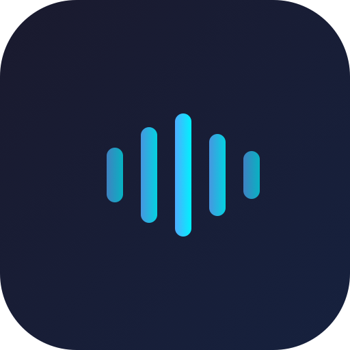
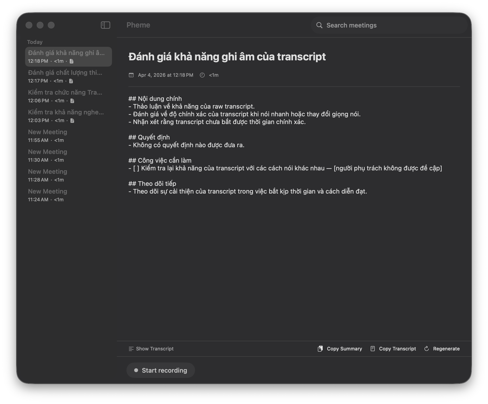

<p align="center">
  
</p>

<h1 align="center">Pheme</h1>

<p align="center">
  <b>AI meeting notes for macOS, optimized for Vietnamese.</b>
</p>

<p align="center">
  <a href="LICENSE"></a>
  <a href="https://swift.org"></a>
  <a href="#requirements"></a>
</p>

<p align="center">
  <a href="#quick-start">Quick Start</a> ·
  <a href="#features">Features</a> ·
  <a href="#how-it-works">How It Works</a> ·
  <a href="#contributing">Contributing</a>
</p>

<p align="center">
  
</p>

Record meetings, get real-time transcripts, and auto-generate structured summaries — all running natively on macOS. Built for Vietnamese and mixed Vietnamese/English conversations.

## Quick Start

```bash
# Clone and build
git clone https://github.com/sonpiaz/pheme.git
cd pheme
make generate
make build
make run
```

Or open `Pheme.xcodeproj` in Xcode directly.

## Features

- **Dual-stream recording** — captures your mic (Me) and system audio (Them) simultaneously
- **Real-time transcript** — live speech-to-text as you speak, not after you finish
- **Auto-generated summaries** — structured notes with key points, decisions, and action items
- **Vietnamese-first** — optimized for Vietnamese and mixed-language meetings
- **Pause / Resume** — pause recording without ending the meeting
- **Privacy-first** — no bot joins your calls, audio is never stored
- **Menu bar controls** — start, stop, and monitor from the macOS menu bar
- **Search** — full-text search across all meeting titles and transcripts

## How It Works

```
┌─────────────┐     ┌──────────────┐     ┌─────────────────┐
│  Microphone  │────▶│  AudioChunker │────▶│  RealtimeAPI     │
│  (AVAudio)   │     │  (24kHz PCM)  │     │  (Me transcript) │
└─────────────┘     └──────────────┘     └────────┬────────┘
                                                   │
┌─────────────┐     ┌──────────────┐     ┌─────────▼────────┐
│ System Audio │────▶│  AudioChunker │────▶│  RealtimeAPI     │
│ (CoreAudio)  │     │  (24kHz PCM)  │     │ (Them transcript)│
└─────────────┘     └──────────────┘     └────────┬────────┘
                                                   │
                                          ┌────────▼────────┐
                                          │  GPT-4o-mini     │
                                          │  (Summary Gen)   │
                                          └─────────────────┘
```

**Audio capture** uses AVAudioEngine for mic and Core Audio Taps (`CATapDescription`) for system audio — capturing all other apps without joining your call.

**Transcription** streams PCM16 audio at 24kHz over WebSocket to OpenAI's Realtime Transcription API (`gpt-4o-transcribe`), with server-side VAD for natural turn detection.

**Summaries** are generated via OpenAI Chat Completions (GPT-4o-mini) in the same language as the transcript.

## Requirements

- macOS 14.2+ (Sonoma)
- OpenAI API key
- Microphone permission
- Screen Recording permission (for system audio capture)

## Setup

1. Launch Pheme
2. Grant microphone permission when prompted
3. Grant Screen Recording permission in System Settings → Privacy & Security
4. Enter your OpenAI API key in Settings (⌘,)

## Project Structure

```
Sources/Pheme/
├── App/            # Entry point, AppState
├── Audio/          # MicRecorder, SystemAudioRecorder, DualStreamMixer, AudioChunker
├── Transcription/  # RealtimeTranscriber (WebSocket), TranscriptionSession
├── Summary/        # SummaryGenerator, SummaryPrompts
├── Storage/        # SwiftData models (Meeting, TranscriptSegment)
├── UI/             # SwiftUI views
└── System/         # SoundFeedback, LaunchAtLogin, CustomDictionary, Permissions
```

## Tech Stack

- **UI**: SwiftUI + SwiftData
- **Audio**: AVAudioEngine, Core Audio Taps
- **Transcription**: OpenAI Realtime API (WebSocket)
- **Summaries**: OpenAI Chat Completions (GPT-4o-mini)
- **Build**: XcodeGen

## Contributing

Contributions are welcome! See [CONTRIBUTING.md](CONTRIBUTING.md) for guidelines.

## License

MIT — see [LICENSE](LICENSE) for details.

## Why "Pheme"?

Named after [Pheme](https://en.wikipedia.org/wiki/Pheme) (Φήμη) — the Greek goddess of fame, rumor, and voice. She heard everything and spread the word.
